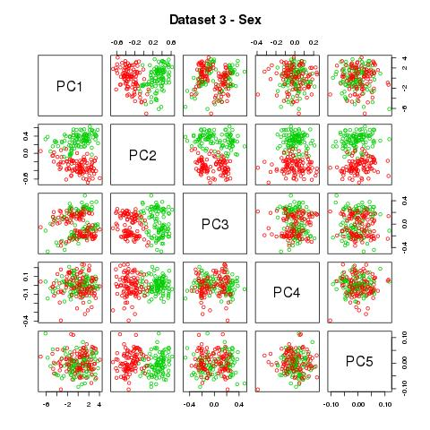
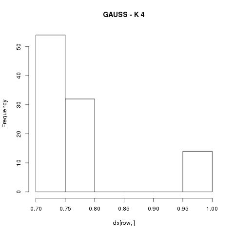

Minería de datos  - Trabajo Práctico 3 (2016)
=============================================

Alumnos: Agretti, José Francisco - Figueroa, Lauro Jesús
========================================================

Implementaciones:
-----------------

* [**ej1a.r**][ej1a] Código de ejercicio 1.a.
* [**ej1b.r**][ej1b] Código de ejercicio 1.b.
* [**ej2.r**][ej2] Implementaciones de los métodos GAP Statistic y Estabilidad.
* [**ej3_gap.r**][ej3_gap] Código para generar el output.
* [**ej3_est.r**][ej3_est] Código para generar las imágenes.

Ejercicio 1a
============

Propiedades de los Datasets de Crabs
------------------------------------
 - ds1: dataset original.
 - ds2: ds1 con tranformación logarítmica.
 - ds3: ds2 con PCA.
 - ds4: ds2 con centrado y escalado.
 - ds5: ds2 con PCA sin escalar.
 - ds6: ds2 con PCA sin escalar, luego centrado y escalado.

Gráficas de los datasets, separando por los atributos especie y género:

Las imágenes se generaron con los siguientes datos, que se interpretan de la siguiente forma:
Método aplicado - Atributo - Cluster clasificado
## Tabla Especies

|Dataset|  K-Mean B-C1  | K-Mean B-C2 | K-Mean O-C1  | K-Mean O-C2 | Hclust<-Single B-C1 | Hclust-Single B-C2 | Hclust-Single O-C1 |  Hclust-Single O-C2 | Hclust-Average B-C1    |   Hclust-Average B-C2   |  Hclust-Average O-C1  | Hclust-Average O-C2   | Hclust-Complete B-C1   | Hclust-Complete B-C2   | Hclust-Complete O-C1    | Hclust-Complete O-C2   |
|:-------:|----|----|----|----|-----|---|----|---|-----|----|----|----|----|----|----|----|
| 1 | 39 | 61  | 57  | 43 | 100 | 0 | 99  | 1 | 69 | 31 | 46  | 54 | 62 | 38 | 43 | 57 |
| 2 | 48 | 52  | 27  | 73 | 99  | 1 | 100 | 0 | 20 | 80 | 6   | 94 | 48 | 52 | 27 | 73 |
| 3 | 52 | 48  | 73  | 27 | 99  | 1 | 100 | 0 | 2  | 98 | 1   | 99 | 48 | 52 | 27 | 73 |
| 4 | 48 | 52  | 27  | 73 | 99  | 1 | 100 | 0 | 2  | 98 | 1   | 99 | 48 | 52 | 27 | 73 |
| 5 | 48 | 52  | 27  | 73 | 99  | 1 | 100 | 0 | 20 | 80 | 6   | 94 | 48 | 52 | 27 | 73 |
| 6 | 0  | 100 | 100 | 0  | 99  | 1 | 100 | 0 | 99 | 1  | 100 | 0  | 97 | 3  | 90 | 10 |

## Tabla Sexo

|Dataset|  K-Mean F-C1  | K-Mean F-C2 | K-Mean M-C1  | K-Mean M-C2 | Hclust-Single F-C1 | Hclust-Single F-C2 | Hclust-Single M-C1 |  Hclust-Single M-C2 | Hclust-Average F-C1  | Hclust-Average F-C2 |  Hclust-Average M-C1  | Hclust-Average M-C2 | Hclust-Complete F-C1   | Hclust-Complete F-C2   | Hclust-Complete M-C1    | Hclust-Complete M-C2   |
|:-------:|----|----|----|----|-----|---|----|---|-----|----|----|----|----|----|----|----|
| 1 | 47 | 53 | 49 | 51 | 99 | 1 | 100 | 0 | 63 | 37 | 52  | 48 | 53 | 47 | 52  | 48 |
| 2 | 36 | 64 | 39 | 61 | 99 | 1 | 100 | 0 | 14 | 86 | 12  | 88 | 36 | 64 | 39  | 61 |
| 3 | 64 | 36 | 61 | 39 | 99 | 1 | 100 | 0 | 1  | 99 | 2   | 98 | 36 | 64 | 39  | 61 |
| 4 | 36 | 64 | 39 | 61 | 99 | 1 | 100 | 0 | 1  | 99 | 2   | 98 | 36 | 64 | 39  | 61 |
| 5 | 36 | 64 | 39 | 61 | 99 | 1 | 100 | 0 | 14 | 86 | 12  | 88 | 36 | 64 | 39  | 61 |
| 6 | 50 | 50 | 50 | 50 | 99 | 1 | 100 | 0 | 99 | 1  | 100 | 0  | 87 | 13 | 100 | 0  |

Podemos observar que en los datasets donde se aplicó PCA se puede visualizar mejor las clases.

### Análisis de Kmeans

Se puede ver que en el Dataset seis encontró una buena clusterización de los datos según la especie.

### Análisis de Hclust

Notamos que el algoritmo no pudo encontrar la representación real de los atributos descriptos en Crabs.

Ejercicio 1b
============

Propiedades de los Datasets de Lampone
------------------------------------
 - ds1: dataset original con filtrado.
 - ds2: ds1 con filtrado y PCA sin escalar
 - ds3: ds1 con centrado y escalado
 - ds4: ds1 con filtrado y PCA sin escalar.
 - ds5: ds1 con PCA sin escalar, luego centrado y escalado

Las imágenes se generaron con los siguientes datos, que se interpretan de la siguiente forma:
Método aplicado - Atributo - Cluster clasificado

### Tabla year of measurements

 |  Dataset |  K-Mean 2006-C1  |  K-Mean 2006-C2  |  K-Mean 2007-C1  |  K-Mean 2007-C2  |  Hclust<-Single 2006-C1  | Hclust<-Single 2006-C2  |  Hclust<-Single 2007-C1  | Hclust<-Single 2007-C2  |  Hclust-Average 2006-C1  | Hclust-Average 2006-C2  |  Hclust-Average 2007-C1  | Hclust-Average 2007-C2  |  Hclust-Complete 2006-C1  | Hclust-Complete 2006-C2  |  Hclust-Complete 2007-C1  |  Hclust-Complete 2007-C2  |
 |---|----|----|----|----|----|---|----|---|----|---|----|---|----|---|----|----|
 | 1 | 17 | 2  | 2  | 28 | 18 | 1 | 29 | 1 | 18 | 1 | 29 | 1 | 18 | 1 | 24 | 6  |
 | 2 | 19 | 0  | 1  | 29 | 19 | 0 | 29 | 1 | 19 | 0 | 29 | 1 | 19 | 0 | 9  | 21 |
 | 3 | 0  | 19 | 29 | 1  | 19 | 0 | 29 | 1 | 19 | 0 | 29 | 1 | 19 | 0 | 10 | 20 |
 | 4 | 17 | 2  | 2  | 28 | 18 | 1 | 29 | 1 | 18 | 1 | 29 | 1 | 18 | 1 | 24 | 6  |
 | 5 | 2  | 17 | 14 | 16 | 18 | 1 | 29 | 1 | 18 | 1 | 29 | 1 | 18 | 1 | 27 | 3  |

### Tabla blueberry specie

|  Dataset |  K-Mean 10-C1  |  K-Mean 10-C2  |  K-Mean 2-C1  |  K-Mean 2-C2  |  Hclust<-Single 10-C1  | Hclust<-Single 10-C2  |  Hclust<-Single 2-C1  | Hclust<-Single 2-C2  |  Hclust-Average 10-C1  | Hclust-Average 10-C2  |  Hclust-Average 2-C1  | Hclust-Average 2-C2  |  Hclust-Complete 10-C1  | Hclust-Complete 10-C2  |  Hclust-Complete 2-C1  |  Hclust-Complete 2-C2  |
|---|----|----|----|----|----|---|----|---|----|---|----|---|----|----|----|---|
| 1 | 9  | 18 | 10 | 12 | 26 | 1 | 21 | 1 | 26 | 1 | 21 | 1 | 23 | 4  | 19 | 3 |
| 2 | 10 | 17 | 10 | 12 | 27 | 0 | 21 | 1 | 27 | 0 | 21 | 1 | 10 | 17 | 18 | 4 |
| 3 | 17 | 10 | 12 | 10 | 27 | 0 | 21 | 1 | 27 | 0 | 21 | 1 | 10 | 17 | 19 | 3 |
| 4 | 9  | 18 | 10 | 12 | 26 | 1 | 21 | 1 | 26 | 1 | 21 | 1 | 23 | 4  | 19 | 3 |
| 5 | 9  | 18 | 7  | 15 | 26 | 1 | 21 | 1 | 26 | 1 | 21 | 1 | 26 | 1  | 19 | 3 |

### Análisis de Kmeans

Se puede ver que K-Means sobre el atributo *year of measurements*, logra en todos los dataset excepto en el ds5 una excelente clusterización. Mientras que sobre el atributo *blueberry* no logra el mismo nivel de precisión, es más, no obtiene ninguna clusterización representativa del atributo.

### Análisis de Hclust

En ambos atributos no logra ningún resultado significativo.

## Nota sobre el ej1:
Estos análisis realizados los concluimos así porque una buena clusterización estaría representada si un cluster estaría compuesto mayoritariamente por un atributo y el otro cluster con los datos restantes, por lo que este contendría la mayor parte del atributo "opuesto". Por ejemplo si en un cluster agrupo la mayor parte del sexo masculino y el otro el femenino, seria una buena clusterización.

Ejercicio 3
===========

### GAP Statistic
Tras ejecutar el script ej3_gap, obtuvimos el siguiente output:
>[1] "Gauss - Original: 4 PCA: 4 Scale-PCA: 4"  
>[1] "Iris - Original: 7 PCA: 4 Scale-PCA: 3  
>[1] "Crabs - Original: 1 PCA: 2 Scale-PCA: 2"  
>[1] "Lampone - Original: 1 PCA: 4 Scale-PCA: 3"

- Para el caso de las cuatro gausianas, se puede ver que es indistinto al proceso de trasformar los datos, pues el resultado es siempre cuatro.
- En Iris se observa que a medida que se transforman los datos aplicando escalado y PCA la precisión de GAP aumenta, pues sabemos que el dataset tiene tres clases.
- En el caso de Crabs, se puede observar que aplicar mas transformaciones sobre los datos no mejora la clasificación porque ambos métodos dan el mismo resultado.
- Para Lampone se observa que (obviando el original) a medida que se aumenta la cantidad de transformaciones sobre los datos, se reduce el número de clusters.

Observamos que a lo largo de las pruebas se obtiene mejores resultados al aplicar GAP sobre datos transformados con escalado y PCA (Scale-PCA).

### Estabilidad

Aplicamos el algoritmo de estabilidad para encontrar el número natural de clusters de los datasets dados.
Las gráficas a continuación las usamos para ver la consentración bajo los histogramas y así poder concluir el número natural de clusters sugeridos por el algoritmo.

#### Crabs

- La concentración bajo los histogramas del dataset Crabs sugiere que hay dos cluesters.

#### Gauss

- En en el dataset Gauss se puede ver que la mayor concentración bajo el histograma es con K=4.

#### Iris

- En Iris a diferencia del resultado anterior, la cantidad de clusters sugeridos es dos o tres. Siguiendo nuestro razonamiento, diríamos que dos es mas estable que tres, aunque sabemos que tres es el numero correcto de clusters en el dataset importado.

#### Lampone

- Por último, vemos en Lampone que con K=3 se encuentra la mayor concentración bajo el histograma, seguida por la concentración con K=2.

[ej1a]: ej1a.r
[ej1b]: ej1b.r
[ej2]: ej2.r
[ej3_gap]: ej3_gap.r
[ej3_est]: ej3_est.r
